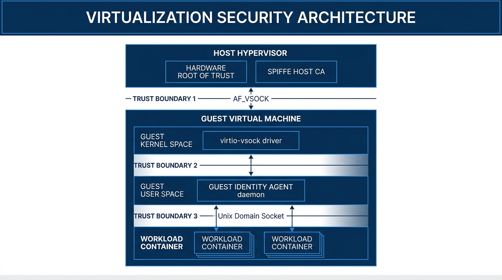
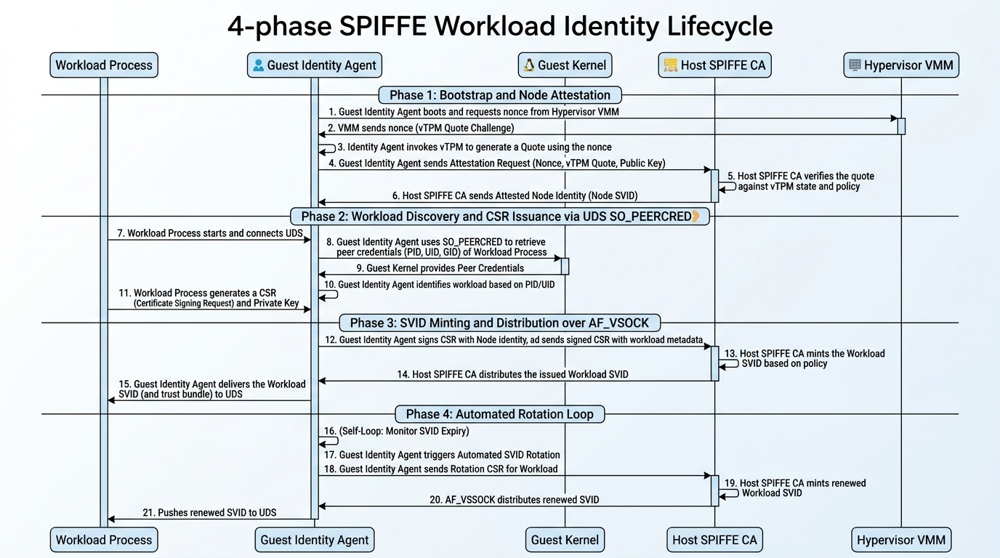
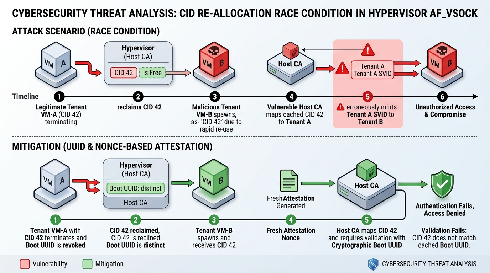
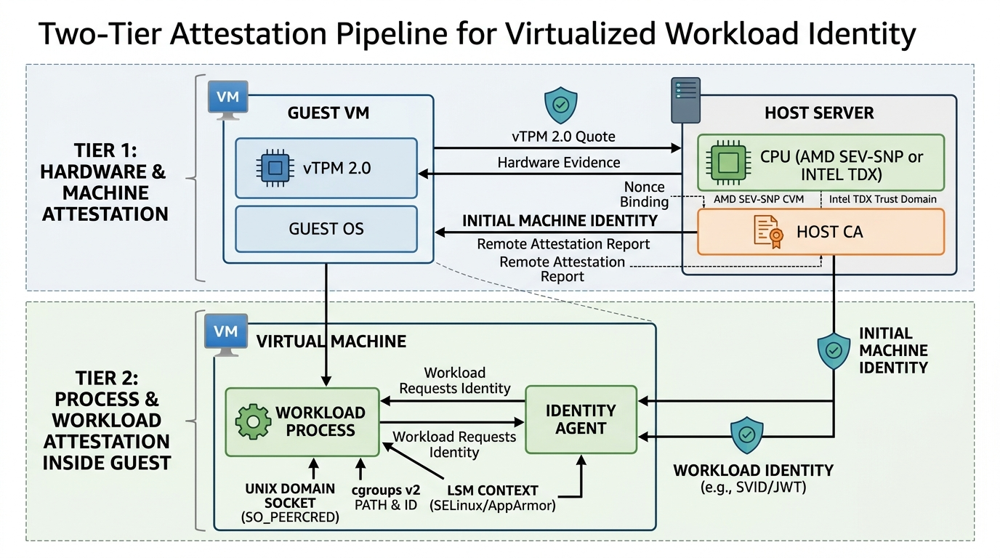
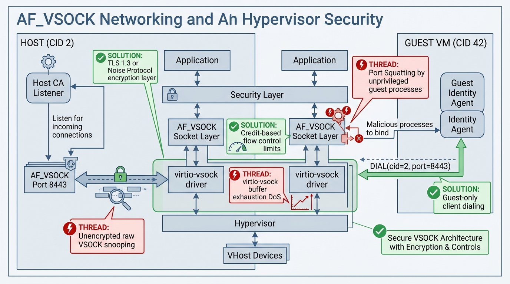
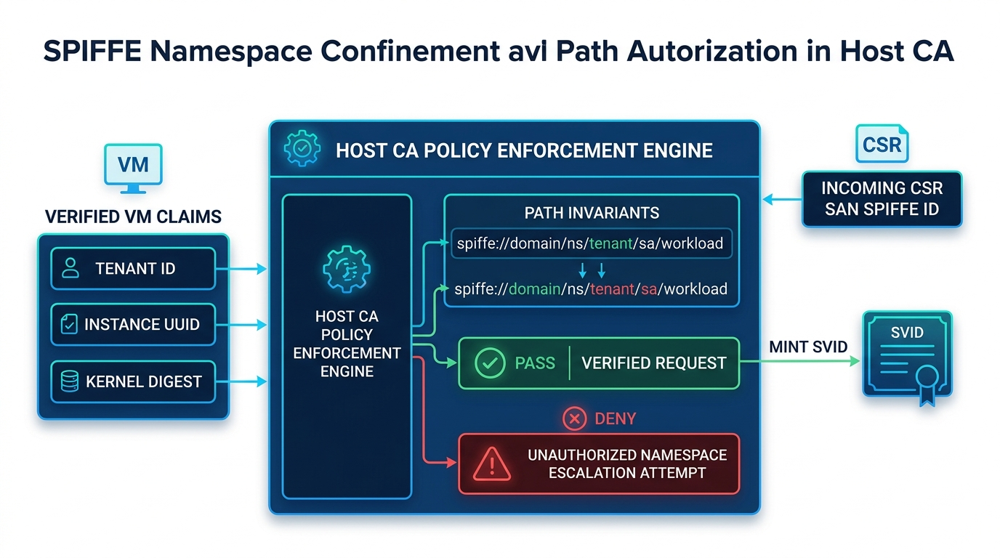
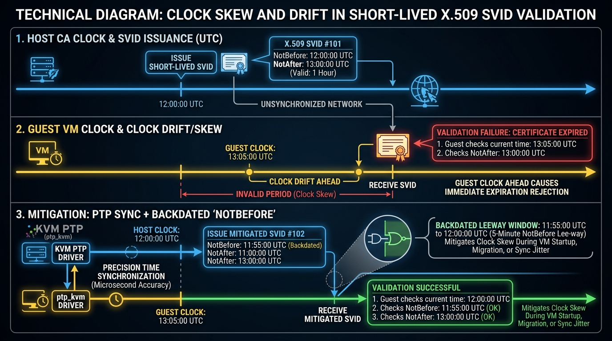
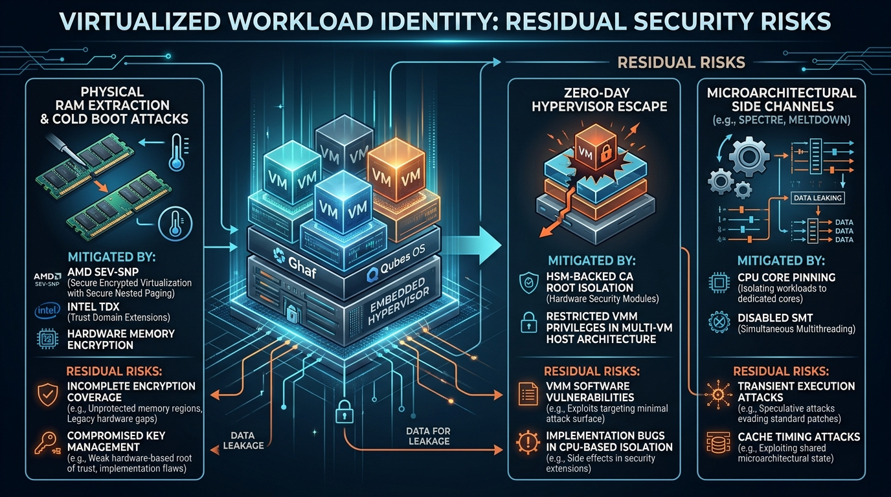

# Hyper-SVID Threat Model

**Scope:** Host SPIFFE CA $\longleftrightarrow$ Guest Agent over `AF_VSOCK`  
**Framework:** STRIDE &middot; **Stack:** Rust / Tokio / `AF_VSOCK`

---

## 1. Trust Boundaries & Data Flow Diagram (DFD)

### 1.1 Architectural Layers & Trust Boundaries

The system architecture partitions trust across hypervisor, guest kernel, guest daemon, and unprivileged workload boundaries. Inter-node transport relies exclusively on hardware-isolated `AF_VSOCK` channels without general routable IP connectivity.



#### Identified Trust Boundaries

1. **TB-1: Host Hypervisor $\longleftrightarrow$ Guest VM (`AF_VSOCK` Interface)**
   - **Assumptions:** The host hypervisor and host CA engine form the Root of Trust. The guest kernel and userspace are treated as untrusted or semi-trusted multi-tenant execution environments. `vhost-vsock` multiplexes packets across Context IDs (CIDs).
2. **TB-2: Guest Kernel $\longleftrightarrow$ Guest User Space (Agent Isolation)**
   - **Assumptions:** The Guest Identity Agent relies on kernel IPC primitives (`SO_PEERCRED`, cgroups v2, namespace descriptors) to attest local workloads. A compromised guest kernel compromises all guest workloads.
3. **TB-3: Guest Identity Agent $\longleftrightarrow$ Workload Processes (Unix Domain Socket)**
   - **Assumptions:** Workload containers run as unprivileged UIDs/GIDs in distinct namespaces and must not be able to read peer workloads' SVIDs or the Agent's memory.
4. **TB-4: Hypervisor VMM $\longleftrightarrow$ Host CA Engine (Internal Control Plane)**
   - **Assumptions:** Internal host IPC; metadata passing (e.g., mapping VM UUID $\longleftrightarrow$ CID $\longleftrightarrow$ Allowed SPIFFE ID Regex) must be tamper-proof against host-side sidecars.

---

### 1.2 End-to-End Lifecycle Sequence Diagram

The workload identity lifecycle encompasses four discrete phases: Node Bootstrap & Attestation, Workload Discovery & CSR Generation, SVID Minting & Distribution, and Automated Rotation.



#### Lifecycle Operations Breakdown

1. **Phase 1: Bootstrap & Node Attestation**
   - The Guest Identity Agent initializes an ephemeral keypair and fetches hardware-backed measurement evidence (vTPM quote, AMD SEV-SNP report, or Intel TDX quote).
   - The Agent connects to the Host CA over `AF_VSOCK` (Host CID `2`, Port `8443`), challenges with a host-supplied nonce, and establishes mutual node trust.
2. **Phase 2: Workload Discovery & CSR Generation**
   - A tenant application connects to the local Workload API (`/run/spiffe/workload.sock`).
   - The Agent extracts calling process metadata via `SO_PEERCRED` and `/proc/<pid>/cgroup` to resolve workload selectors.
   - The Agent generates a private key locally inside the guest and packages a PKCS#10 CSR.
3. **Phase 3: SVID Minting & Distribution**
   - The Agent sends the CSR along with node claims across the authenticated VSOCK channel.
   - The Host CA validates namespace confinement rules, signs the leaf X.509-SVID, and streams the certificate chain back.
4. **Phase 4: Automated Rotation & Push Delivery**
   - At $50\%$ of the certificate lifetime, the Agent transparently generates a new keypair and requests renewal over VSOCK, pushing the updated bundle down the active UDS stream.

---

## 2. Identity Attestation & Guest Verification

### 2.1 The Impostor / CID Churn Vulnerability

In `vhost-vsock`, a guest is identified by its 32-bit Context ID (`CID`). When a VM terminates, its CID is returned to the pool and can be reassigned to a newly launched VM.



> [!WARNING]
> **CID Reuse Hazard:** If the Host CA caches authorization state indexed purely by `CID`, a newly launched VM inheriting a recently vacated CID can intercept SVIDs belonging to the prior tenant.

#### Architectural Mitigations
- **Cryptographic Boot UUID:** Every VM launch must inject a random 128-bit `Instance Boot UUID` via hypervisor ACPI/fw_cfg.
- **Freshness Nonce:** Handshakes require a 256-bit cryptographically secure random nonce generated by the Host CA and signed inside the measurement evidence.
- **Epoch Tracking:** The Host CA invalidates all cached session state upon VMM teardown notifications.

---

### 2.2 Two-Tier Attestation Pipeline

Attestation is separated into distinct machine-level and process-level tiers:



| Attestation Level | Primary Mechanism | Trust Anchor | Cryptographic Binding |
| :--- | :--- | :--- | :--- |
| **Tier 1: Machine / Hardware** | AMD SEV-SNP Report / Intel TDX Quote / vTPM 2.0 Quote | Silicon Endorsement Key (VCEK/SGX Root) or Virtual AK Cert | Host Nonce + Hash of Agent Ephemeral Public Key placed in Attestation Report Data |
| **Tier 2: Process / Workload** | Linux Kernel `SO_PEERCRED`, cgroups v2 hierarchy, `SO_PEERSEC` | Guest Linux Kernel Subsystem | Calling PID mapped to cgroup slice and UID/GID before processing requests |

---

## 3. Transport & Protocol Security over `AF_VSOCK`

### 3.1 Transport Threat Vectors & Hardening Architecture

While `AF_VSOCK` operates across hypervisor memory boundaries rather than an external IP network, raw VSOCK sockets lack transport-level authentication and encryption.



#### Critical Protocol Rules
1. **Unidirectional Dialing Policy:**
   - **The Host CA MUST strictly listen (CID `2`, Port `8443`).**
   - **Guest Agents MUST only dial (never listen).**
   - This completely eliminates guest port-squatting race conditions where unprivileged processes bind to listening ports before the daemon starts.
2. **Encrypted Session Layer:**
   - Deploy **TLS 1.3 or Noise Protocol (`Noise_IKpsk2_25519_ChaChaPoly_BLAKE2s`)** directly over the byte stream to ensure Perfect Forward Secrecy (PFS) and protection against hypervisor sidecar inspection.
3. **Credit-Based Flow Control & DoS Defense:**
   - Bound maximum concurrent streams per CID to $2$.
   - Enforce explicit socket timeouts: `SO_RCVTIMEO` and `SO_SNDTIMEO` set to $\le 2000 \text{ ms}$.

---

## 4. SPIFFE Identity Lifecycle & Namespace Confinement

### 4.1 Namespace Escalation & Server-Side Path Confinement

A compromised guest agent must never be capable of minting credentials outside its assigned namespace.



#### Policy Invariant Formula
$$\text{URI} \stackrel{?}{=} \text{"spiffe://" } \parallel \text{TrustDomain} \parallel \text{"/ns/" } \parallel \text{VM.Tenant} \parallel \text{"/sa/" } \parallel \text{WorkloadName}$$

- The Host CA validates that the requested SAN path strictly adheres to the regex: `^spiffe://[a-z0-9\.\-]+/ns/[a-z0-9\-]+/sa/[a-z0-9\-]+$`
- Any presence of wildcard SANs (`*`), directory traversal (`/../`), or null-byte characters results in immediate session termination and security alerts.

---

### 4.2 Clock Drift & Short-Lived SVID Validation

SPIFFE relies on short certificate validity windows ($30\text{--}60 \text{ minutes}$) in place of heavy CRL/OCSP checking.



#### Clock Synchronization Invariants
1. **Precision Time Sync:** VMs must utilize `ptp_kvm` (Precision Time Protocol over KVM clock) to keep guest-host drift under $1\text{ ms}$.
2. **Backdated Leeway Window:** Host CA issues SVIDs with `notBefore = Now() - 5 minutes` to ensure immediate validity even during startup or migration clock jitter.

---

## 5. Implementation & Memory Safety (Rust-Specific Analysis)

### 5.1 FFI & Socket Struct Zeroization

```rust
// Correct initialization of sockaddr_vm to prevent kernel stack leaks
#[repr(C)]
pub struct sockaddr_vm {
    pub svm_family: libc::sa_family_t,
    pub svm_reserved1: libc::c_ushort,
    pub svm_port: libc::c_uint,
    pub svm_cid: libc::c_uint,
    pub svm_zero: [u8; 4],
}

impl sockaddr_vm {
    pub fn new_host_listener(port: u32) -> Self {
        let mut addr: Self = unsafe { std::mem::MaybeUninit::zeroed().assume_init() };
        addr.svm_family = libc::AF_VSOCK as libc::sa_family_t;
        addr.svm_port = port;
        addr.svm_cid = libc::VMADDR_CID_ANY;
        addr
    }
}
```

### 5.2 Key Material Pinning & Memory Zeroization

```rust
use zeroize::{Zeroize, ZeroizeOnDrop};

#[derive(Zeroize, ZeroizeOnDrop)]
pub struct EphemeralPrivateKey {
    key_bytes: [u8; 32],
}

impl EphemeralPrivateKey {
    pub fn new_pinned() -> Result<Self, Box<dyn std::error::Error>> {
        let mut key = Self { key_bytes: [0u8; 32] };
        unsafe {
            let ptr = key.key_bytes.as_ptr() as *const libc::c_void;
            let len = key.key_bytes.len();
            // Prevent paging private key to swap disk
            if libc::mlock(ptr, len) != 0 {
                return Err("mlock failed".into());
            }
            // Exclude memory page from coredump generation
            libc::madvise(ptr as *mut libc::c_void, len, libc::MADV_DONTDUMP);
        }
        ring::rand::SystemRandom::new().fill(&mut key.key_bytes)?;
        Ok(key)
    }
}
```

---

## 6. Comprehensive STRIDE Threat Matrix

| Threat ID | STRIDE Category | Component / Boundary | Attack Vector / Scenario | Impact | Recommended Mitigation |
| :--- | :--- | :--- | :--- | :--- | :--- |
| **TH-01** | **Spoofing** | Host CA / `AF_VSOCK` (TB-1) | **CID Recycle Attack:** VM terminates; new VM reuses CID and inherits cached credentials. | High (Identity Theft) | 1. Never trust CID alone.<br>2. Require hardware-bound attestation (vTPM / SEV-SNP) containing a fresh Host Nonce.<br>3. Bind session to a unique VM Boot UUID. |
| **TH-02** | **Spoofing** | Guest Agent / UDS (TB-3) | **UDS PID Reuse:** Workload terminates; attacker process spawns with same PID and calls Workload API. | Critical (SVID Hijacking) | 1. Query `SO_PEERCRED` immediately upon `accept()` before processing payloads.<br>2. Correlate PID with `/proc/<pid>/cgroup` creation timestamp. |
| **TH-03** | **Tampering** | `AF_VSOCK` Bus (TB-1) | **Unencrypted VSOCK Tampering:** Host memory corruption or VMM exploit modifies CSR in flight. | Critical (Unauthorized Key Signing) | Mandatory TLS 1.3 or Noise Protocol session established directly over the `AF_VSOCK` stream. |
| **TH-04** | **Tampering** | Guest Memory (TB-2) | **Cold-Boot / Memory Dump:** Private key dumped during core dump or swap-out. | High (Key Leakage) | Use `mlock()` and `madvise(MADV_DONTDUMP)`. Zeroize key memory buffers on drop via `ZeroizeOnDrop`. |
| **TH-05** | **Repudiation** | Host CA Engine (TB-4) | **Unsigned Issuance Logs:** CA operator or compromised guest denies having requested/minted SVID. | Medium (Audit Failure) | Host CA produces cryptographically signed, append-only audit log events (e.g., using RFC 6962 / Trillian format). |
| **TH-06** | **Info Disclosure** | Guest Agent / UDS (TB-3) | **UDS Permission Flaw:** World-readable `/run/spiffe/workload.sock` permits unconfined processes to probe selectors. | High (Metadata / Token Leak) | Restrict socket permissions (`0660` owned by `root:spiffe`). Enforce mandatory Linux Security Modules (LSM: SELinux/AppArmor) rules. |
| **TH-07** | **Info Disclosure** | `sockaddr_vm` FFI (TB-1) | **Uninitialized Memory Leak:** Rust FFI struct fails to zero padding bytes before `libc::bind`. | Low (Kernel Memory Leak) | Zero-initialize all C structs using `std::mem::MaybeUninit::zeroed()`. |
| **TH-08** | **Denial of Service**| Host CA Listener (TB-1) | **VSOCK Connection Storm:** Compromised guest opens thousands of connections, exhausting host file descriptors. | High (CA Service Outage) | Bounded concurrency with `tokio::sync::Semaphore`, strict per-CID rate limits, and short connection timeouts (`SO_RCVTIMEO`). |
| **TH-09** | **Denial of Service**| Guest Tokio Runtime (TB-2) | **Crypto CPU Starvation:** Workload hammers Agent with SVID requests, starving the Tokio event loop. | Medium (Agent Unresponsive) | Wrap all cryptographic routines in `tokio::task::spawn_blocking`. Enforce per-workload request rate limiting. |
| **TH-10** | **Elevation of Priv**| Host CA Policy (TB-4) | **Namespace Escape:** Guest Agent crafts CSR requesting `spiffe://.../ns/admin/sa/root`. | Critical (Cluster-Wide Takeover) | Strict Server-Side Path Confinement: Host CA ignores requested SPIFFE ID and forcefully asserts SPIFFE ID derived strictly from verified VM metadata. |

---

## 7. Residual Risks & Hardening Checklist

### 7.1 Residual Risks Taxonomy

Certain threats cannot be resolved through application software layers alone and require hardware-level containment.



---

### 7.2 Production Hardening Checklist

#### A. Host CA & Hypervisor Configuration
- [x] **HSM / KMS Root Delegation:** Host CA root signing keys MUST reside in a FIPS 140-3 Level 3 HSM or dedicated Secure Enclave; the hypervisor CA holds only short-lived sub-CA intermediates.
- [x] **Forceful Path Derivation:** The Host CA MUST construct the SPIFFE ID entirely from verified hypervisor metadata; CSR SAN values from guests must only be accepted if strictly matching verified policy.
- [x] **VSOCK Resource Limits:** Configure `vhost-vsock` with strict buffer limits per CID and enforce iptables/ebpf socket filters where applicable.
- [x] **Auditing & Telemetry:** All SVID minting operations must emit structured telemetry including `vm_uuid`, `cid`, `spiffe_id`, `pcr_digest`, and `timestamp`.

#### B. Transport & Protocol Layer
- [x] **Authenticated Transport:** Deploy TLS 1.3 or Noise Protocol over `AF_VSOCK` to ensure payload encryption and mutual authentication.
- [x] **Reverse Dialing Only:** Guest Agent dials Host CA (CID 2); Host CA NEVER dials Guest CIDs directly.
- [x] **Leeway on Expiration:** Issue SVIDs with $5\text{ minute}$ pre-dated `notBefore` windows to prevent clock-drift-induced immediate invalidation.

#### C. Guest Identity Agent Hardening
- [x] **Drop Privileges:** The Agent must initialize its privileged VSOCK and UDS sockets at startup, then immediately drop all capabilities except `CAP_DAC_OVERRIDE` or run under dedicated non-root `uid=10001:gid=10001`.
- [x] **Socket Permissions:** Workload UDS (`/run/spiffe/workload.sock`) must be created with `0660` permissions under dedicated group ownership, enforced with SELinux type `spiffe_agent_socket_t`.
- [x] **Secure Heap & Memory:** Compile with `#![forbid(unsafe_code)]` outside the dedicated low-level FFI module; enforce `mlock()`, `madvise(MADV_DONTDUMP)`, and `zeroize` for all private keys.
- [x] **Strict Compiler Flags:** Build the Rust binary with:
  ```toml
  [profile.release]
  opt-level = 3
  lto = "fat"
  codegen-units = 1
  panic = "abort"
  overflow-checks = true
  strip = true
  ```
  And link with stack protectors and full RELRO (`-C link-arg=-Wl,-z,relro,-z,now`).
